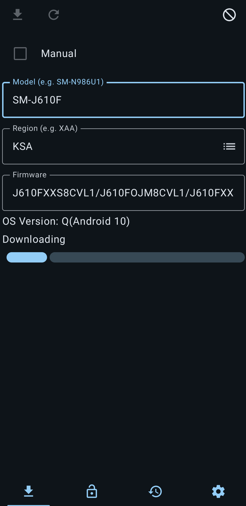
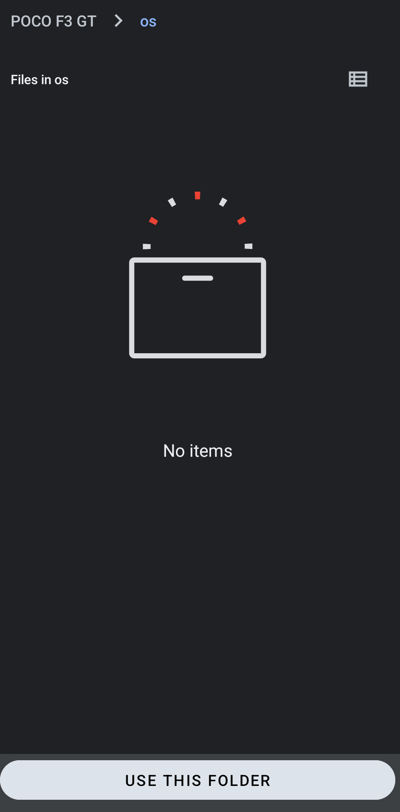
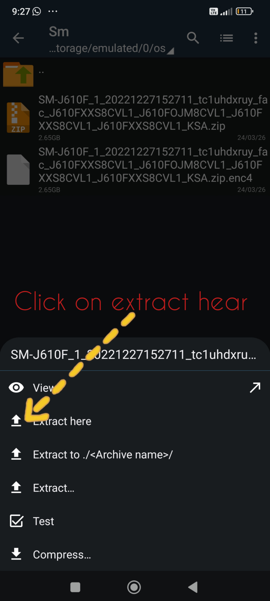
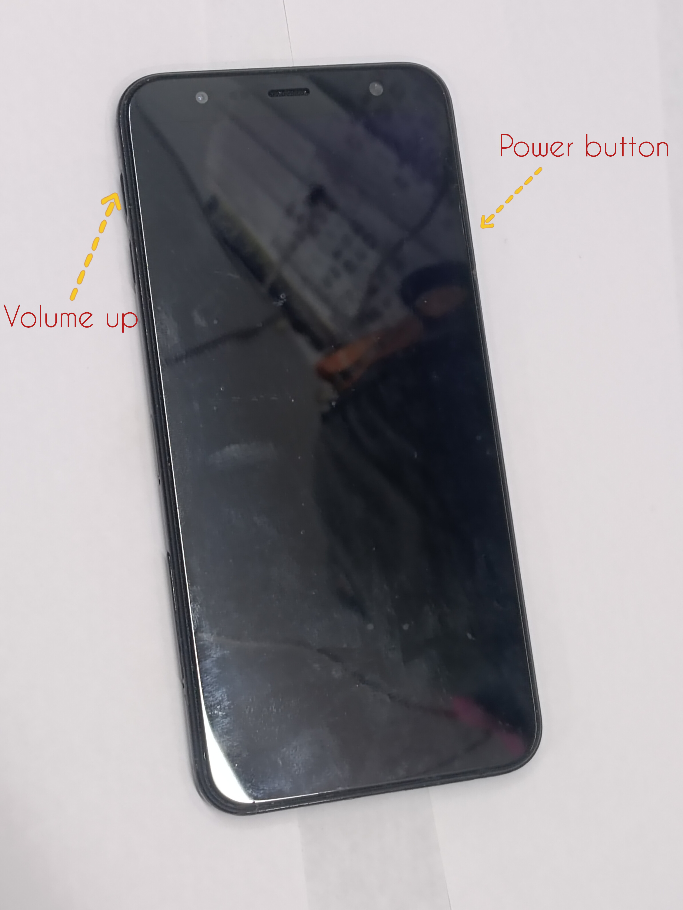
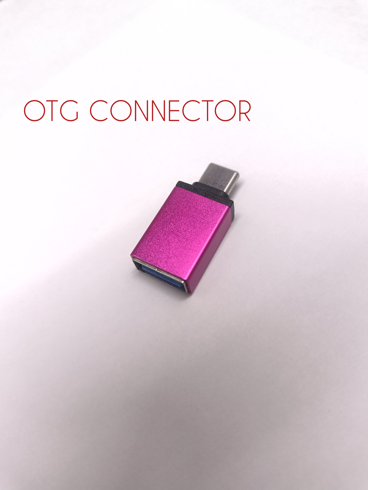
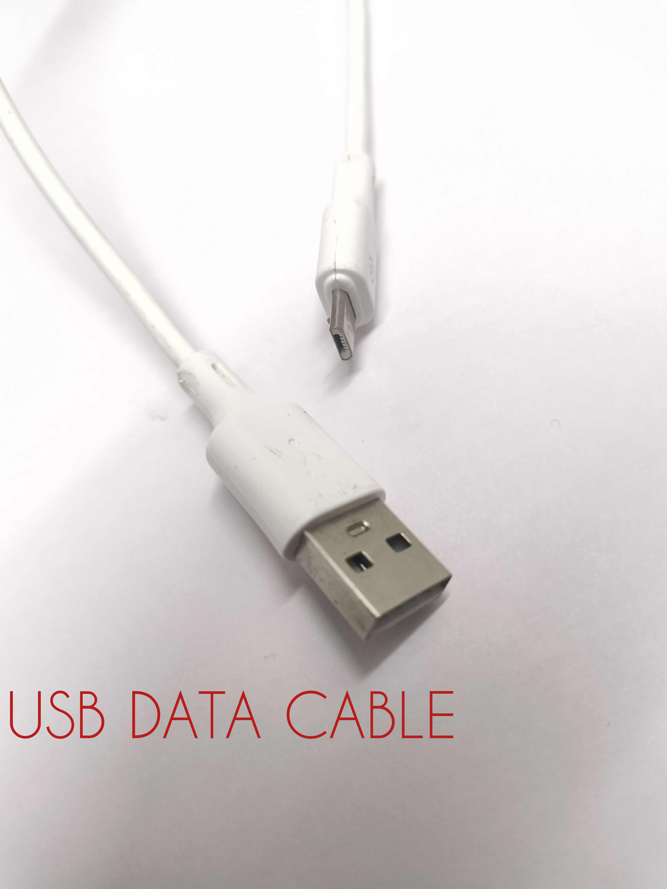
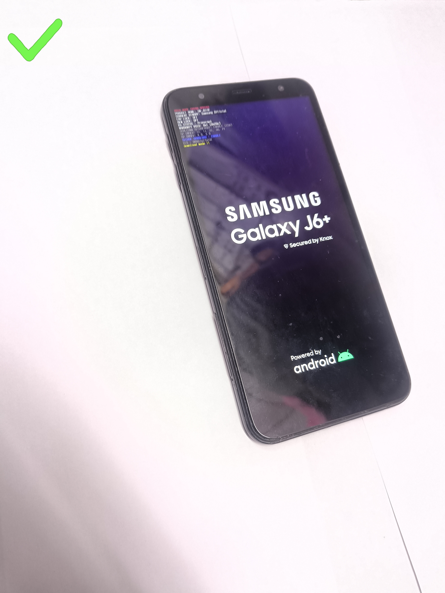
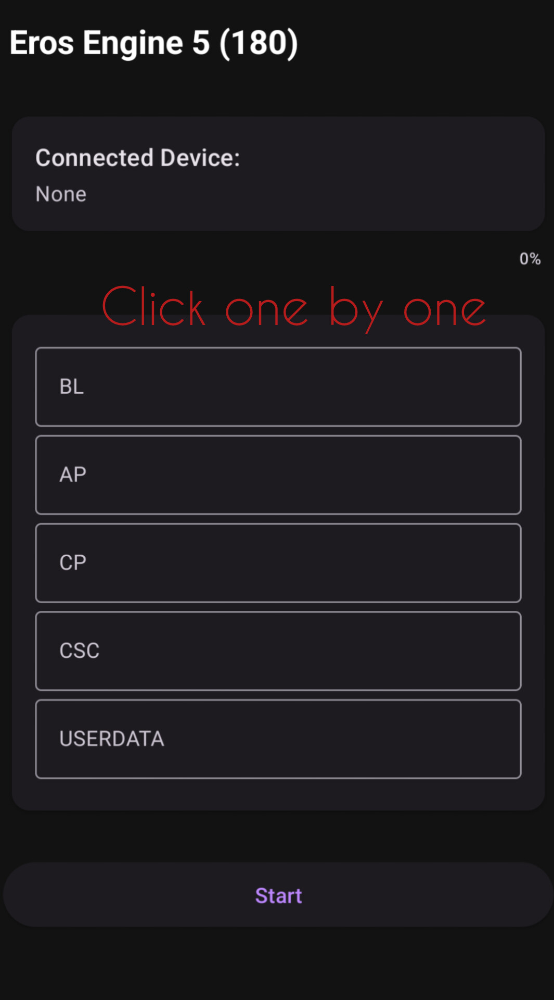
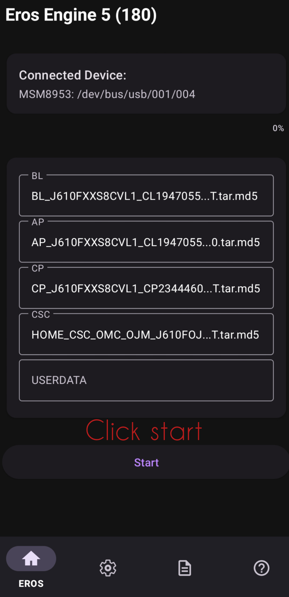
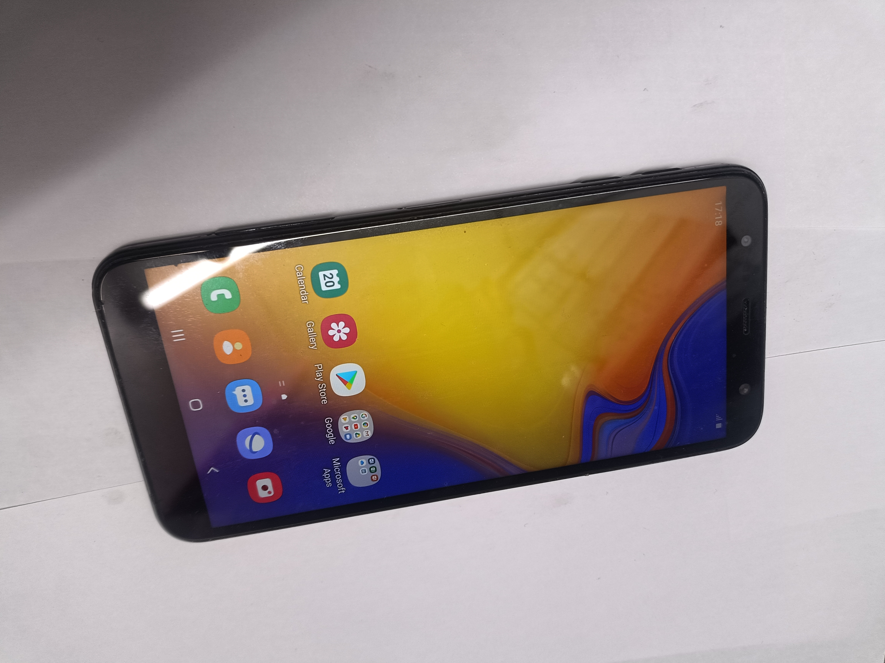

# Samsung Galaxy J6+ PC-less Firmware Flash

Professional firmware restoration using a Poco F3 GT host, OTG, and Eros Engine.

---

## **1. Firmware & Extraction**
| Bifrost Download | Folder Setup | ZArchiver |
|---|---|---|
|  |  |  |

---

## **2. Connection**
 |
*OTG and Micro-USB bridge.*

---

## **3. Flashing Environment**
| Recovery Mode | Download Mode |
|---|---|
|  |  |

---

## **4. Execution (Eros Engine)**
 | 
---|---

---

## **5. Final Success**

**Project by MARZ INDIA**
